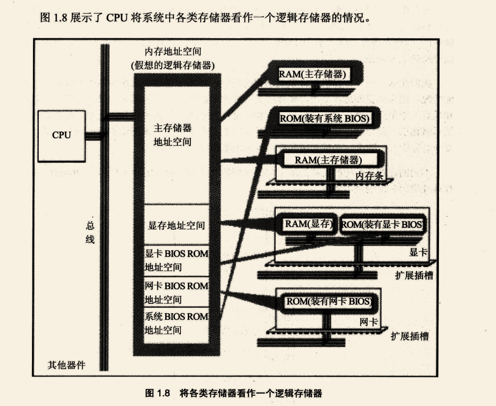
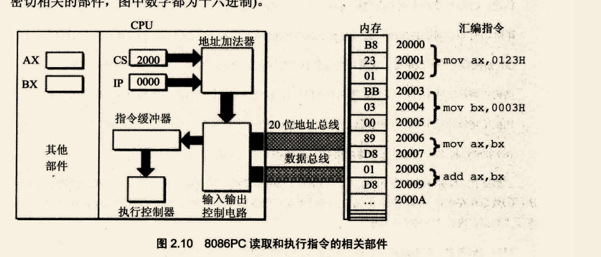

# 汇编语言（第3版）


## **第 1~3 章 基础知识**

### **机器语言**

-   由 **机器指令**（一系列二进制数字）构成。
-   直接被 CPU 解读执行，是计算机唯一能够理解的语言。

### **汇编语言**

-   **概念**：
    -   对应机器语言的 **低级语言**，是机器指令的 **助记符形式**，便于人类理解。
-   **组成**：
    1. **汇编指令**（主体）：
        - 是机器指令的可读表达形式。
        - 常用格式：`操作码 + 操作数`（如 `MOV AX, 10`）。
    2. **伪指令**：
        - 辅助程序设计的非机器指令，如数据定义、流程控制等。
        - 示例：`DB`（定义字节数据）。
    3. **符号**：
        - 标签、变量名等，提升代码可读性。

### **存储器**

-   **功能**：存储 **指令和数据**（形式上无区别，均为二进制数）。
-   **特点**：
    -   **内存**：位于 CPU 外部，通过总线与 CPU 通信。
    -   **存储单元**：每个存储单元存储 **1 个字节**。
-   **分类**：
    1. **ROM**（Read-Only Memory）：
        - 只读存储器，断电后数据不丢失。
        - 常用于存储固件。
    2. **RAM**（Random Access Memory）：
        - 随机存储器，断电后数据丢失。
        - 主要用作运行程序的临时存储空间。
        - 常见种类：
            - 主板上的内存条。
            - **接口卡上的 RAM**：如显卡、网卡上的专用存储器。



### **CPU 对数据和指令的读写**

**(1) CPU 对数据的读写**

**三大总线：**

-   **地址总线**：定位内存地址。
    -   N 根地址总线（宽度为 N），可寻址 $2^N$ 个内存单元。
-   **控制总线**：控制操作类型，如读或写。
-   **数据总线**：负责数据的传输。
    -   每 8 根数据总线可传输 1 个字节。

**(2) 8086 CPU 读取与执行指令的过程**

**1. 地址计算：**

-   **`CS:IP`**：
    -   **CS**：段地址（指向当前代码段的基地址）。
    -   **IP**：偏移地址（指向段内的具体指令位置）。
-   将 **段地址和偏移地址** 传递给 **地址加法器**。
-   地址加法器计算物理地址：
    $$
    \text{物理地址} = \text{段地址} \times 16 + \text{偏移地址}
    $$

**2. 内存访问**

-   **地址总线**：将计算出的物理地址通过地址总线发送给内存。
-   **控制总线**：发出“读”信号，指示内存读取操作。
-   **数据总线**：将内存中物理地址对应的指令数据传送到 CPU。

**3. 指令缓存**

-   **输入输出电路**：接收从内存读取的指令数据，并传递到 **指令缓冲器**。
-   **指令缓冲器**：暂时存储读取到的指令，为执行阶段做好准备。

**4. 指令执行**

-   **执行控制器**：从指令缓冲器中获取指令，解码并执行。



### **寄存器**

**(1) 通用寄存器**

-   **AX**：累加器，常用于算术运算和数据传输，某些指令默认操作对象。
-   **BX**：基址寄存器，可存放偏移地址，支持间接寻址（`DS:[BX]`）。
-   **CX**：计数寄存器，主要用于循环和字符串操作中的计数。
-   **DX**：数据寄存器，用于扩展乘法和除法操作。

**(2) 段寄存器**

-   **`CS`（代码段寄存器）**：配合 **IP**，指向当前代码段的基地址。
-   **`DS`（数据段寄存器）**：指向数据段的基地址，配合偏移地址访问数据。
-   **`SS`（栈段寄存器）**：配合 **SP**，指向当前栈顶位置。
-   **`ES`（附加段寄存器）**：常用于字符串操作中的附加段，支持段间数据传输。

**(3) 指针和索引寄存器**

-   **SI**：通常用于 BX 的额外寄存。
-   **DI**：通常用于 BX 的额外寄存。
-   **BP（基指针寄存器）**：与 **BX** 类似，但默认指向栈段（`SS:[BP]`）。

### **汇编指令总结**

1. **`mov`**：赋值操作

    - 功能：将数据从一个位置传输到另一个位置。
    - 格式：`mov 目标, 源`。
        - **目标**可以是寄存器或内存地址。
        - **源**可以是寄存器、内存地址或立即数。
    - 示例：`mov AX, 10`（将立即数 10 赋值到 AX 寄存器）。

2. **`add`**：加法操作

    - 功能：对两个操作数相加，将结果存入目标操作数。
    - 格式：`add 目标, 源`。
    - 示例：`add AX, 5`（将 AX 寄存器的值加 5，结果存入 AX）。

3. **`sub`**：减法操作

    - 功能：对目标操作数减去源操作数，将结果存入目标操作数。
    - 格式：`sub 目标, 源`。
    - 示例：`sub CX, 1`（将 CX 的值减 1，结果存入 CX）。

4. **`jmp`**：跳转操作

    - 功能：将程序流程跳转到指定的标号（标签）位置，改变 `CS:IP` 指针的值。
    - 示例：`jmp label`（跳转到标号 `label` 的位置继续执行）。

5. **`push`**：入栈操作

    - 功能：
        - (SP)=(SP)-2
        - 向 SS:SP 指向的字单元送入数据
    - 格式：`push 寄存器/内存/立即数`。
    - 示例：`push CX`（将 CX 寄存器的值压入栈中）。

6. **`pop`**：出栈操作

    - 功能：
        - 从 SS:SP 指向的字单元读取数据
        - (SP)=(SP)+2
    - 格式：`pop 寄存器`。
    - 示例：`pop CX`（将栈顶的值弹出，并存入 CX 寄存器）。

7. **`loop`**：循环

    - 功能：
        - (CX)=(CX)-1
        - 判断 CX 中的值，不为 0 跳转，为 0 向下执行
    - 格式：`loop 标号`。
    - 示例：`loop s`（跳转到标号）。

8. **`and`**：逻辑与指令，按位进行与运算

    - 功能：置 0
    - 格式：`and xxxxxxxxb`。
    - 示例：`and 11011111b`（将第 5 位置 0，小写变大写）。

9. **`or`**：逻辑或指令，按位进行或运算

    - 功能：置 1
    - 格式：`or xxxxxxxxb`。
    - 示例：`or 00100000b`（将第 5 位置 1，大写变小写）。

## 第 4~6 章

**汇编程序从写出到执行的过程**：

```
编程（Edit）-> 源程序（xxx.asm）-> 编译（masm） -> 目标文件（xxx.obj）-> 连接（link）-> 可执行文件（程序、相关描述信息）（xxx.exe）-> 加载（command）-> 内存中的程序-> 运行（CPU）
```

## 第 7~8 章

