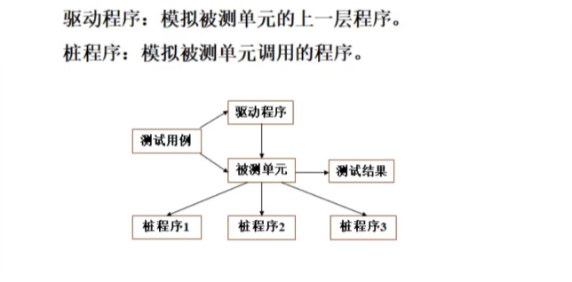
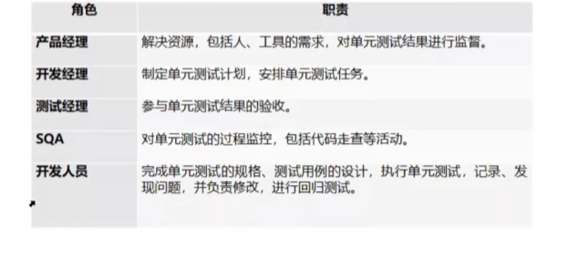
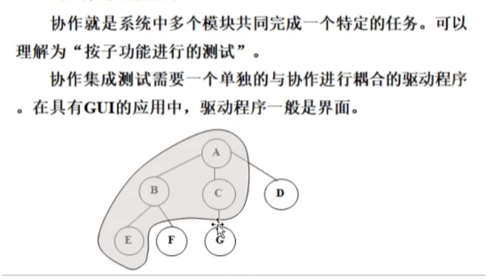
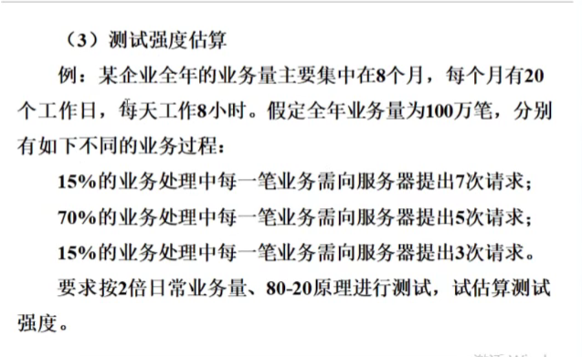
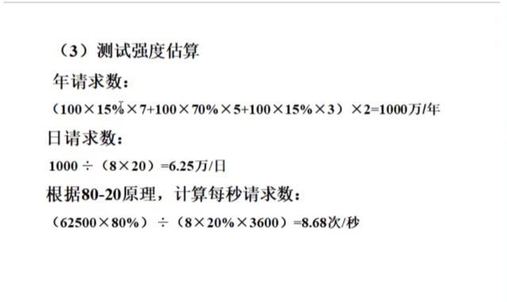

# Software Testing

## 第 一 章 软件测试概述

### 1.1 软件质量的基本概念

#### 1.1.1 软件危机表现

-   项目无法按期完成
-   费用超出预算
-   质量难以控制
-   运行难以维护

### 1.2 软件质量

#### 1.2.3 软件错误

**软件错误/软件缺陷（Bug）**：计算机程序系统或程序中存在的任何一种破坏正常运行能力的问题、错误或隐藏的功能缺陷、瑕疵。

**4 种级别**：

1. **致命的**：系统整体影响、数据丢失
2. **严重的**：主要功能缺陷
3. **一般的**：次要功能缺陷
4. **微小的**：基本不影响-外观

### 1.3 软件测试基本知识

#### 1.3.1 软件测试定义

-   **狭义定义**：软件测试是为了发现错误而**执行程序**的过程。
-   **广义定义**：
    1. **确认**：文档
    2. **验证**：功能
    3. **测试**：程序

#### 1.3.3 软件测试的辩证观点

1. **正向思维**：“工作的”-正确性。
2. **反向思维**：“不工作的”-不正确性。

## 第 二 章 软件测试策略

### 2.1 软件测试的生命周期

**测试顺序**：性能测试；可靠性测试；安全性测试。

在软件测试中，将测试的**输入数据**定义和**预期结果**的描述记为测试用例。

## 第 三 章 黑盒测试

-   **特征**：把程序或测试看成一个**黑盒子**，验证**输入与输出之间的关系是否正确**；**不考虑程序内部的结构和特性**。
-   **目标**：测试程序的功能或接口，检查是否符合需求规格说明书。

### 3.2 等价类划分测试方法

#### 3.2.4 等价类划分原则

1. **取值范围**：一个有效等价类，两个无效等价类
2. **集合或“必须如何”的条件**：一个有效等价类，一个无效等价类
3. **布尔量**：一个有效等价类，一个无效等价类
4. **一组值（n 个）**：n 个有效等价类，一个无效等价类

## 第 四 章 白盒测试

### 4.1 静态白盒测试和动态白盒测试

#### 4.1.1 静态白盒测试

不运行软件：

1. 走查、复审、评审程序源代码
2. 检查数据组织、环境设置和软件配置项

#### 4.1.2 动态白盒测试

1. 分析程序代码
2. 设计测试用例
3. 通过**驱动程序**和**桩程序**来驱动、调用**被测程序**的运行

## 第 五 章 单元测试

#### 5.2.1 角色和职责

## 第 六 章 集成测试

#### 6.3.1 一次性集成测试

1. 适用场景
    - 被测系统曾经稳定运行
    - 规模不大
    - 构件之间紧密联系
2. 特点
    - 优点：用例少，测试快
    - 缺点：错误定位难，调试难

#### 6.3.2 自顶向下集成测试

1. 适用场景
    - 自顶向下增量式开发
    - 并行式开发
2. 特点
    - 不需要开发驱动模块
    - 桩程序开发工作量比较大
    - 对底层模块的测试不够充分

#### 6.3.3 自底向上集成测试

对底层软件充分测试

#### 6.3.4 协作集成集成测试

尽快测试某些子功能：

## 第 七 章 系统测试

1. 整体软件
2. 除软件本身外，还包含需求分析、概要设计、详细设计、用户使用说明等技术文档

### 7.3 性能测试

#### 7.3.1 负载压力测试

**负载测试**：“额定”负载条件（性能极值点之前）
**压力测试**：“饱和”负载条件（性能极值点之后）

## 第 八 章 性能测试

